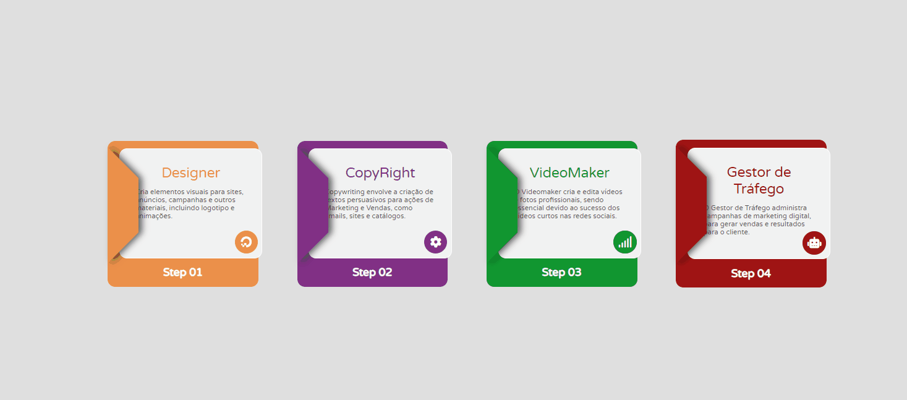

# PersonalQuest - Sample Tiktok 
## user: @codetheworld.io
## Quest - Cards de serviços

### [Deploy](https://josuecosta2023.github.io/cards-html-css/)

## [Repositorio Github](https://github.com/JosueCosta2023/cards-html-css)

# Desafio: 
* Inovar na estilização css 
* Crie um componente de card's de serviços de uma agencia digital.

## Linguagens Utilizadas
* HTML
* CSS

### Screenshots
#### Visualização Desktop

# Author
### Josué Ocanha Costa
#### FrontEnd Developer
#### Redes Sociais

- Linkedin - [JosueOcanhaCosta](https://www.linkedin.com/in/josue-ocanha-costa/)
- Github - [JosueCosta2023](https://github.com/JosueCosta2023)
- Twitter - [@JosueOcanhaCosta](https://twitter.com/josue_ocanha)
- Facebook - [JosueCosta](https://www.facebook.com/JosueOcanhaCosta2023)
- Whatsapp - [Josue2023](https://wa.me/5565996408371?text=Ol%C3%A1%2C+encontrei+seu+whatsapp+no+Github.+Gostaria+de+falar+sobre+seus+projetos.)

#### "Projeto simples e excelente para treinar CSS."
# "Vida longa e próspera. 🖖🖖🖖"
